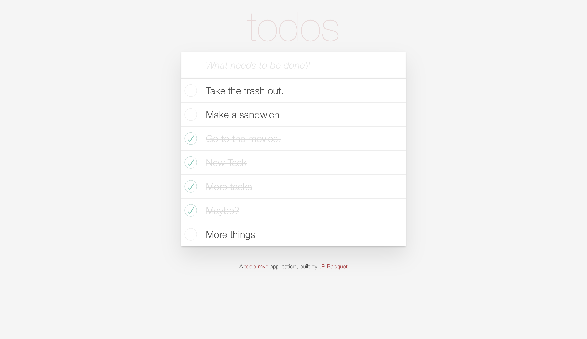

# Tasks - Single Page Todo Application

This single-page to-do application features a fluid user interface that by using JavaScript–allows users to rapidly add dynamic content.

Preview:
https://tasks-jp-bacquet.herokuapp.com

## Features
* [Ruby on Rails](https://guides.rubyonrails.org/) - The web framework used.
* Mobile-responsive.
* Leverages Javascript to dynamically add, edit, delete and toggle tasks as done or not done.
* Fetches task data using RESTful JSON API's from Rails.

## Authors
* **Jean-Pol Bacquet** - *Assignment from UCF Web Boot Camp* - [Tasks - Single Page Todo Application](https://github.com/jeanpolbac/tasks-jp-bacquet)

## Credits
* [UCF - Coding Bootcamp](https://bootcamp.ce.ucf.edu/coding/)
